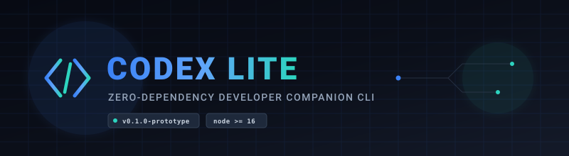
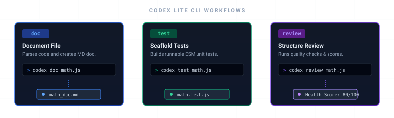
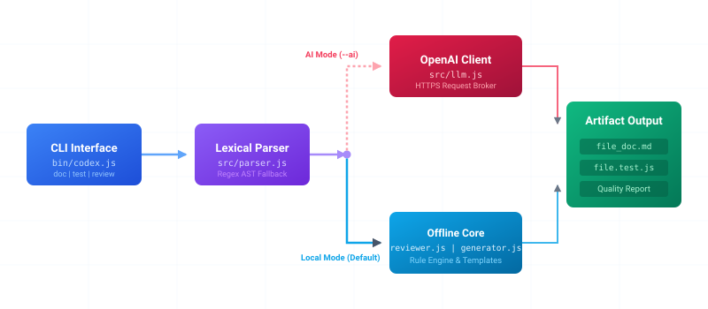

<p align="center">
  
</p>

<p align="center">
  <strong>A zero-dependency developer companion CLI tool to automate code documentation, scaffold unit tests, and review code structure locally or with OpenAI.</strong>
</p>

<p align="center">
  <a href="LICENSE"></a>
  <a href="https://nodejs.org"></a>
  
</p>

---

## Project Status
> [!IMPORTANT]
> **Project Stage: Early Prototype (`v0.1.0-prototype`)**  
> Codex Lite is an early-stage open-source prototype undergoing active review. It is not currently intended or suitable for production environments.

---

## Table of Contents
- [What It Does](#what-it-does)
- [Why Codex Lite?](#why-codex-lite)
- [Repository Structure](#repository-structure)
- [Getting Started](#getting-started)
- [Usage Examples](#usage-examples)
- [Architecture and Design](#architecture-and-design)
- [Current Limitations](#current-limitations)
- [Roadmap](#roadmap)
- [Contributing](#contributing)
- [License](#license)

---

## What It Does
Codex Lite scans JavaScript and Python source files to extract functions, classes, imports, and block comments, running the following tasks:

1. **`doc`**: Generates a clean Markdown documentation summary of all exported structures and internal functions.
2. **`test`**: Automatically scaffolds a boilerplate unit test file targeting the file's API surface.
3. **`review`**: Evaluates files against static structure rules (e.g., function length, lack of comments, nested complexity) and provides code health scores.

<p align="center">
  
</p>

---

## Why Codex Lite?
We believe that AI-assisted coding tools should be transparent, lightweight, and accessible:
- **Zero Runtime Dependencies**: The tool is written in pure vanilla Node.js using standard library modules. No bloated node_modules or heavy library trees.
- **Fast Rule-Based Fallback**: Offline static rules act as a swift parser and review tool without needing an internet connection or incurring LLM API costs.
- **Modulated AI Integration**: A clean, single-file broker requests smart outputs from OpenAI's API when configured, without relying on complex, heavy frameworks.

---

## Repository Structure
Below is an overview of the key folders and files in the repository:

```text
Codex-Open-Source/
├── bin/
│   └── codex.js          # CLI executable entry point
├── docs/
│   └── assets/           # Visual SVG diagrams
│       ├── architecture.svg
│       ├── banner.svg
│       └── workflow.svg
├── examples/
│   └── math.js           # Demo JavaScript file
├── src/
│   ├── generator.js      # Logic for docs & test scaffolding
│   ├── llm.js            # OpenAI HTTPS client broker
│   ├── parser.js         # Lexical regex code parser
│   └── reviewer.js       # Offline quality and rules engine
├── package.json          # Node configuration module
├── LICENSE               # MIT License terms
├── README.md             # This document
├── CONTRIBUTING.md       # Contributing guidelines
├── ROADMAP.md            # Project milestones
└── CHANGELOG.md          # Version log tracker
```

---

## Getting Started

### Prerequisites
- [Node.js](https://nodejs.org/) version 16.0.0 or higher.
- Zero NPM package installations or external runtime dependencies required.

### Installation
Clone the repository:
```bash
git clone https://github.com/MohmmadSalame/Codex-Open-Source.git
cd Codex-Open-Source
```

---

## Usage Examples

### 1. Generate Markdown Documentation
Run the documentation tool on a file to extract its API surface:
```bash
node bin/codex.js doc examples/math.js
```
*Creates `examples/math_doc.md` detailing all functions and classes.*

### 2. Scaffold a Unit Test File
Generate an ESM-compatible test file with pre-filled test suites:
```bash
node bin/codex.js test examples/math.js
```
*Generates `examples/math.test.js` importing the target functions with mock test cases.*

### 3. Review Code Structure & Health
Run static structure rules to score code complexity and documentation coverage:
```bash
node bin/codex.js review examples/math.js
```
*Outputs a detailed CLI report with line-by-line warnings and a global codebase health score.*

### 4. Enable AI-Assisted Mode (Optional)
Provide an `OPENAI_API_KEY` to run LLM-powered context generation instead of the rule-based local parser:
```bash
# On Windows PowerShell
$env:OPENAI_API_KEY="your-api-key"
node bin/codex.js doc examples/math.js --ai

# On Linux/macOS
OPENAI_API_KEY="your-api-key" node bin/codex.js doc examples/math.js --ai
```

---

## Architecture and Design

<p align="center">
  
</p>

Codex Lite is split into four distinct modules under `src/`:
- [parser.js](src/parser.js): A lightweight regex lexer extracting functions, classes, and parameter structures.
- [reviewer.js](src/reviewer.js): Static code check engine mapping lines to rule violations.
- [generator.js](src/generator.js): Formats internal node trees into documentation tables or test boilerplates.
- [llm.js](src/llm.js): Handles HTTP connections to the OpenAI API without external library overhead.

---

## Current Limitations
Since Codex Lite is an early-stage prototype, it currently operates under the following constraints:
- **Lexical Parsing Only**: The current parser uses regular expressions rather than a fully-featured Abstract Syntax Tree (AST). Complex constructs (such as object destructuring parameters, multiline parameters, or nested classes) may not be parsed with complete accuracy.
- **Limited Languages**: It currently supports JavaScript and Python source files only.
- **Node.js Test Framework**: Scaffolding test files relies specifically on the built-in `node:test` framework introduced in Node 18, and is not yet customizable to alternate testing frameworks (e.g., Jest or Vitest).

---

## Roadmap
For the full plan and milestones, see [ROADMAP.md](ROADMAP.md).
- **v0.1.0** (Current): Core rule-based engine, CLI wrapper, and basic static review.
- **v0.2.0**: AST parsing using standard lightweight parser, expanded language support (Go/Rust).
- **v0.3.0**: Bi-directional syncing (updating code directly based on generated doc edits).

---

## Contributing
We welcome contributions to Codex Lite! Please see [CONTRIBUTING.md](CONTRIBUTING.md) for guidelines on how to submit pull requests, report issues, and suggest features.

---

## License
Distributed under the MIT License. See [LICENSE](LICENSE) for more information.
